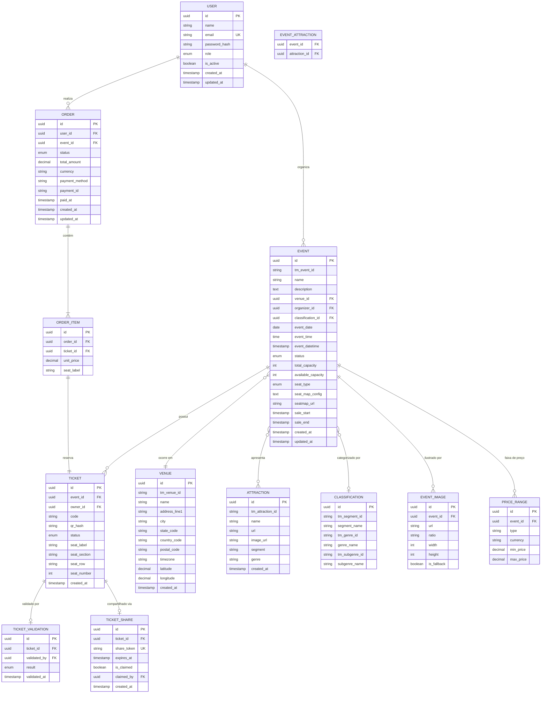

# MER — Modelo Entidade-Relacionamento · ViaPass

> **Stack:** Node.js · Express · TypeORM · PostgreSQL
> **Versão:** 1.0 · Agosto 2026

---

## 1. Visão Geral

O ViaPass é uma plataforma de eventos e ingressos com três perfis de acesso:

| Perfil | Descrição |
|---|---|
| **Organizador** | Cria eventos a partir do catálogo Ticketmaster, define data/local/capacidade/preço |
| **Cliente** | Navega, reserva, paga (simulado) e recebe ingresso com QR Code |
| **Portaria** | Valida ingressos na entrada do evento via leitura de QR ou digitação manual |

---

## 2. Diagrama Entidade-Relacionamento



---

## 3. Dicionário de Dados

### 3.1 `users`

| Coluna | Tipo | Constraints | Descrição |
|---|---|---|---|
| `id` | `UUID` | PK, DEFAULT uuid_generate_v4() | Identificador único |
| `name` | `VARCHAR(255)` | NOT NULL | Nome completo |
| `email` | `VARCHAR(255)` | NOT NULL, UNIQUE | Email de login |
| `password_hash` | `VARCHAR(255)` | NOT NULL | Senha com bcrypt (12 rounds) |
| `role` | `ENUM('organizer','client','gate')` | NOT NULL, DEFAULT 'client' | Perfil de acesso |
| `is_active` | `BOOLEAN` | DEFAULT true | Soft-delete flag |
| `created_at` | `TIMESTAMPTZ` | DEFAULT NOW() | — |
| `updated_at` | `TIMESTAMPTZ` | DEFAULT NOW() | — |

> **Índices:** `idx_users_email` (UNIQUE), `idx_users_role`

---

### 3.2 `events`

| Coluna | Tipo | Constraints | Descrição |
|---|---|---|---|
| `id` | `UUID` | PK | Identificador interno |
| `tm_event_id` | `VARCHAR(64)` | NULLABLE, UNIQUE | ID original Ticketmaster (se importado) |
| `name` | `VARCHAR(255)` | NOT NULL | Título do evento |
| `description` | `TEXT` | NULLABLE | Descrição longa / info |
| `venue_id` | `UUID` | FK → venues.id, NOT NULL | Local do evento |
| `organizer_id` | `UUID` | FK → users.id, NOT NULL | Organizador responsável |
| `classification_id` | `UUID` | FK → classifications.id, NULLABLE | Classificação (segmento/gênero) |
| `event_date` | `DATE` | NOT NULL | Data local do evento |
| `event_time` | `TIME` | NULLABLE | Hora local (null = TBA) |
| `event_datetime` | `TIMESTAMPTZ` | NULLABLE | Data/hora UTC completa |
| `status` | `ENUM('draft','published','onsale','offsale','canceled','completed')` | DEFAULT 'draft' | Estado do evento |
| `total_capacity` | `INT` | NOT NULL, CHECK > 0 | Capacidade total de lugares |
| `available_capacity` | `INT` | NOT NULL, CHECK >= 0 | Lugares disponíveis (decrementado atomicamente) |
| `seat_type` | `ENUM('mapped','general_admission')` | NOT NULL | Mapa de assentos ou pista |
| `seat_map_config` | `JSONB` | NULLABLE | Layout de assentos (seções, fileiras, lugares) |
| `seatmap_url` | `VARCHAR(512)` | NULLABLE | URL da imagem do mapa de assentos |
| `sale_start` | `TIMESTAMPTZ` | NULLABLE | Início da venda |
| `sale_end` | `TIMESTAMPTZ` | NULLABLE | Fim da venda |
| `created_at` | `TIMESTAMPTZ` | DEFAULT NOW() | — |
| `updated_at` | `TIMESTAMPTZ` | DEFAULT NOW() | — |

> **Índices:** `idx_events_status`, `idx_events_organizer`, `idx_events_date`, `idx_events_tm_id` (UNIQUE)
>
> **Regra de negócio:** `available_capacity` é decrementado via `UPDATE ... SET available_capacity = available_capacity - :qty WHERE available_capacity >= :qty` para evitar race condition e sobrevenda.

---

### 3.3 `venues`

| Coluna | Tipo | Constraints | Descrição |
|---|---|---|---|
| `id` | `UUID` | PK | — |
| `tm_venue_id` | `VARCHAR(64)` | NULLABLE, UNIQUE | ID Ticketmaster |
| `name` | `VARCHAR(255)` | NOT NULL | Nome do local |
| `address_line1` | `VARCHAR(255)` | NULLABLE | Endereço |
| `city` | `VARCHAR(128)` | NULLABLE | Cidade |
| `state_code` | `VARCHAR(16)` | NULLABLE | UF / State code |
| `country_code` | `VARCHAR(8)` | NULLABLE | Código do país (ISO 3166) |
| `postal_code` | `VARCHAR(32)` | NULLABLE | CEP |
| `timezone` | `VARCHAR(64)` | NULLABLE | Timezone IANA |
| `latitude` | `DECIMAL(10,8)` | NULLABLE | Coordenada |
| `longitude` | `DECIMAL(11,8)` | NULLABLE | Coordenada |
| `created_at` | `TIMESTAMPTZ` | DEFAULT NOW() | — |

> **Índice:** `idx_venues_tm_id` (UNIQUE)

---

### 3.4 `attractions`

| Coluna | Tipo | Constraints | Descrição |
|---|---|---|---|
| `id` | `UUID` | PK | — |
| `tm_attraction_id` | `VARCHAR(64)` | NULLABLE, UNIQUE | ID Ticketmaster |
| `name` | `VARCHAR(255)` | NOT NULL | Nome do artista/show |
| `url` | `VARCHAR(512)` | NULLABLE | Link externo |
| `image_url` | `VARCHAR(512)` | NULLABLE | Imagem principal |
| `segment` | `VARCHAR(128)` | NULLABLE | Segmento (Music, Sports…) |
| `genre` | `VARCHAR(128)` | NULLABLE | Gênero (Rock, Pop…) |
| `created_at` | `TIMESTAMPTZ` | DEFAULT NOW() | — |

---

### 3.5 `event_attractions` (junção N:N)

| Coluna | Tipo | Constraints |
|---|---|---|
| `event_id` | `UUID` | PK, FK → events.id ON DELETE CASCADE |
| `attraction_id` | `UUID` | PK, FK → attractions.id ON DELETE CASCADE |

---

### 3.6 `classifications`

| Coluna | Tipo | Constraints | Descrição |
|---|---|---|---|
| `id` | `UUID` | PK | — |
| `tm_segment_id` | `VARCHAR(64)` | NULLABLE | ID do Segment no TM |
| `segment_name` | `VARCHAR(128)` | NOT NULL | Ex: "Music", "Sports" |
| `tm_genre_id` | `VARCHAR(64)` | NULLABLE | — |
| `genre_name` | `VARCHAR(128)` | NULLABLE | Ex: "Rock", "Comedy" |
| `tm_subgenre_id` | `VARCHAR(64)` | NULLABLE | — |
| `subgenre_name` | `VARCHAR(128)` | NULLABLE | Ex: "Alternative Rock" |

> Tabela desnormalizada propositalmente para simplificar queries de filtro. A hierarquia Segment → Genre → SubGenre da API Ticketmaster é mapeada em uma única linha.

---

### 3.7 `event_images`

| Coluna | Tipo | Constraints | Descrição |
|---|---|---|---|
| `id` | `UUID` | PK | — |
| `event_id` | `UUID` | FK → events.id ON DELETE CASCADE | — |
| `url` | `VARCHAR(512)` | NOT NULL | URL da imagem |
| `ratio` | `VARCHAR(16)` | NULLABLE | "16_9", "3_2", "4_3", "1_1" |
| `width` | `INT` | NULLABLE | Largura px |
| `height` | `INT` | NULLABLE | Altura px |
| `is_fallback` | `BOOLEAN` | DEFAULT false | Imagem genérica de categoria |

---

### 3.8 `price_ranges`

| Coluna | Tipo | Constraints | Descrição |
|---|---|---|---|
| `id` | `UUID` | PK | — |
| `event_id` | `UUID` | FK → events.id ON DELETE CASCADE | — |
| `type` | `VARCHAR(64)` | NULLABLE | "standard", "vip" |
| `currency` | `VARCHAR(8)` | NOT NULL, DEFAULT 'BRL' | Moeda ISO 4217 |
| `min_price` | `DECIMAL(10,2)` | NOT NULL | Preço mínimo |
| `max_price` | `DECIMAL(10,2)` | NOT NULL | Preço máximo |

---

### 3.9 `orders`

| Coluna | Tipo | Constraints | Descrição |
|---|---|---|---|
| `id` | `UUID` | PK | — |
| `user_id` | `UUID` | FK → users.id, NOT NULL | Cliente comprador |
| `event_id` | `UUID` | FK → events.id, NOT NULL | Evento da compra |
| `status` | `ENUM('pending','processing','paid','failed','refunded','canceled')` | DEFAULT 'pending' | Estado do pedido |
| `total_amount` | `DECIMAL(10,2)` | NOT NULL | Valor total |
| `currency` | `VARCHAR(8)` | DEFAULT 'BRL' | — |
| `payment_method` | `VARCHAR(64)` | NULLABLE | "credit_card", "pix", "boleto" |
| `payment_id` | `VARCHAR(255)` | NULLABLE | ID da transação simulada |
| `paid_at` | `TIMESTAMPTZ` | NULLABLE | Momento do pagamento |
| `created_at` | `TIMESTAMPTZ` | DEFAULT NOW() | — |
| `updated_at` | `TIMESTAMPTZ` | DEFAULT NOW() | — |

> **Índices:** `idx_orders_user`, `idx_orders_event`, `idx_orders_status`

---

### 3.10 `order_items`

| Coluna | Tipo | Constraints | Descrição |
|---|---|---|---|
| `id` | `UUID` | PK | — |
| `order_id` | `UUID` | FK → orders.id ON DELETE CASCADE | — |
| `ticket_id` | `UUID` | FK → tickets.id, UNIQUE | 1 item = 1 ticket |
| `unit_price` | `DECIMAL(10,2)` | NOT NULL | Preço unitário pago |
| `seat_label` | `VARCHAR(64)` | NULLABLE | Ex: "Seção A · Fileira 3 · Assento 12" |

---

### 3.11 `tickets`

| Coluna | Tipo | Constraints | Descrição |
|---|---|---|---|
| `id` | `UUID` | PK | — |
| `event_id` | `UUID` | FK → events.id, NOT NULL | — |
| `owner_id` | `UUID` | FK → users.id, NULLABLE | Cliente dono (null = disponível) |
| `code` | `VARCHAR(32)` | NOT NULL, UNIQUE | Código legível (ex: `VP-A3S12-X7K9`) |
| `qr_hash` | `VARCHAR(255)` | NOT NULL, UNIQUE | HMAC-SHA256 do `{ticket_id}:{secret}` — anti-falsificação |
| `status` | `ENUM('available','reserved','sold','used','canceled')` | DEFAULT 'available' | Ciclo de vida do ingresso |
| `seat_label` | `VARCHAR(64)` | NULLABLE | Rótulo do assento (mapped) |
| `seat_section` | `VARCHAR(32)` | NULLABLE | Seção |
| `seat_row` | `VARCHAR(16)` | NULLABLE | Fileira |
| `seat_number` | `INT` | NULLABLE | Número do assento |
| `created_at` | `TIMESTAMPTZ` | DEFAULT NOW() | — |

> **Índices:** `idx_tickets_event`, `idx_tickets_owner`, `idx_tickets_code` (UNIQUE), `idx_tickets_qr_hash` (UNIQUE), `idx_tickets_status`
>
> **Anti-falsificação:** `qr_hash = HMAC_SHA256(ticket.id + ':' + ticket.code, APP_SECRET)`. O QR Code contém o `qr_hash`. Na validação, o backend recalcula e compara.
>
> **Sobrevenda:** Para `seat_type = 'mapped'`, o assento específico possui constraint `UNIQUE(event_id, seat_section, seat_row, seat_number) WHERE status != 'canceled'`.

---

### 3.12 `ticket_validations`

| Coluna | Tipo | Constraints | Descrição |
|---|---|---|---|
| `id` | `UUID` | PK | — |
| `ticket_id` | `UUID` | FK → tickets.id, NOT NULL | Ingresso validado |
| `validated_by` | `UUID` | FK → users.id, NOT NULL | Usuário portaria |
| `result` | `ENUM('valid','invalid','already_used','wrong_event')` | NOT NULL | Resultado da validação |
| `validated_at` | `TIMESTAMPTZ` | DEFAULT NOW() | — |

> Log de auditoria: toda tentativa de validação é registrada, mesmo as com falha.

---

### 3.13 `ticket_shares`

| Coluna | Tipo | Constraints | Descrição |
|---|---|---|---|
| `id` | `UUID` | PK | — |
| `ticket_id` | `UUID` | FK → tickets.id, NOT NULL | — |
| `share_token` | `VARCHAR(128)` | NOT NULL, UNIQUE | Token no link compartilhável |
| `expires_at` | `TIMESTAMPTZ` | NOT NULL | Expiração do link (48h default) |
| `is_claimed` | `BOOLEAN` | DEFAULT false | Se outro usuário resgatou |
| `claimed_by` | `UUID` | FK → users.id, NULLABLE | Quem resgatou |
| `created_at` | `TIMESTAMPTZ` | DEFAULT NOW() | — |

> **Link gerado:** `{BASE_URL}/tickets/claim/{share_token}`

---

## 4. Relacionamentos

| Relação | Cardinalidade | Descrição |
|---|---|---|
| `users` → `events` | 1:N | Um organizador cria vários eventos |
| `events` → `venues` | N:1 | Cada evento ocorre em um local |
| `events` ↔ `attractions` | N:N | Via `event_attractions` |
| `events` → `classifications` | N:1 | Cada evento tem uma classificação |
| `events` → `event_images` | 1:N | Várias imagens por evento |
| `events` → `price_ranges` | 1:N | Faixas de preço por tipo |
| `events` → `tickets` | 1:N | Pool de ingressos do evento |
| `users` → `orders` | 1:N | Cliente faz vários pedidos |
| `orders` → `order_items` | 1:N | Cada pedido tem N itens |
| `order_items` → `tickets` | 1:1 | Cada item é um ingresso |
| `tickets` → `ticket_validations` | 1:N | Histórico de validações |
| `tickets` → `ticket_shares` | 1:N | Links de compartilhamento |

---

## 5. Autenticação e Autorização

### 5.1 Estratégia

| Aspecto | Decisão |
|---|---|
| **Protocolo** | JWT (access token + refresh token) |
| **Access Token** | Duração: 15min. Payload: `{ sub: user.id, role, iat, exp }` |
| **Refresh Token** | Duração: 7 dias. Armazenado em cookie HttpOnly, Secure, SameSite=Strict |
| **Senha** | bcrypt com salt rounds = 12 |
| **Middleware** | `authGuard` valida JWT → `roleGuard(['organizer'])` restringe por perfil |

### 5.2 Matriz de Permissões

| Endpoint | Organizador | Cliente | Portaria | Público |
|---|:---:|:---:|:---:|:---:|
| `GET /events` (listar) | ✅ | ✅ | ✅ | ✅ |
| `GET /events/:id` (detalhe) | ✅ | ✅ | ✅ | ✅ |
| `POST /events` (criar) | ✅ | ❌ | ❌ | ❌ |
| `PUT /events/:id` (editar) | ✅¹ | ❌ | ❌ | ❌ |
| `DELETE /events/:id` | ✅¹ | ❌ | ❌ | ❌ |
| `POST /orders` (checkout) | ❌ | ✅ | ❌ | ❌ |
| `GET /orders/my` (meus pedidos) | ❌ | ✅ | ❌ | ❌ |
| `GET /tickets/my` (meus ingressos) | ❌ | ✅ | ❌ | ❌ |
| `POST /tickets/:id/share` | ❌ | ✅ | ❌ | ❌ |
| `POST /tickets/claim/:token` | ❌ | ✅ | ❌ | ❌ |
| `POST /gate/validate` | ❌ | ❌ | ✅ | ❌ |
| `GET /catalog/search` (TM API) | ✅ | ❌ | ❌ | ❌ |

> ¹ Apenas o organizador dono (`organizer_id = user.id`)

---

## 6. Escopo da API Ticketmaster e Mapeamento

### 6.1 O que a Discovery API retorna (e o que NÃO retorna)

A Ticketmaster Discovery API v2 é **exclusivamente uma API de catálogo/busca**. Ela serve apenas para pesquisar eventos, artistas e locais. Não fornece nenhum dado de inventário, assentos ou ingressos individuais.

**✅ O que a API retorna (usado como template de importação):**

| Dado | Campo da API | Descrição |
|---|---|---|
| Dados do evento | `name`, `info`, `pleaseNote`, `url` | Informações descritivas |
| Datas | `dates.start.localDate`, `localTime`, `dateTime` | Data/hora do evento |
| Status | `dates.status.code` | "onsale", "offsale", "canceled"… |
| Faixa de preço | `priceRanges[*]` | Preço **agregado** (min/max) — não é preço por assento |
| Imagem do seatmap | `seatmap.staticUrl` | **Imagem PNG estática** do mapa — não é mapa interativo |
| Imagens | `images[*]` | Fotos promocionais do evento |
| Classificação | `classifications[*]` | Segmento → Gênero → SubGênero |
| Local | `_embedded.venues[*]` | Nome, endereço, coordenadas |
| Atrações | `_embedded.attractions[*]` | Artistas, bandas, shows |
| Limite de ingressos | `ticketLimit.info` | Texto informativo (ex: "8 por household") |

**❌ O que a API NÃO retorna:**

| Dado ausente | Consequência para o ViaPass |
|---|---|
| Lista de assentos disponíveis | Gerenciado internamente via `tickets` + `seat_map_config` |
| Status individual de cada assento | Controlado pelo campo `tickets.status` |
| Ingressos individuais com preço por lugar | Criados pelo organizador ao publicar o evento |
| Mapa de assentos estruturado (seções, fileiras) | Definido no `events.seat_map_config` (JSONB) |
| Inventário em tempo real | Controlado por `events.available_capacity` com lock otimista |

> As APIs de inventário e compra da Ticketmaster (Commerce API, Partner API, Inventory Status API) exigem parceria comercial e não são públicas.

### 6.2 Fluxo de Importação

```
 Organizador                    ViaPass Backend              Ticketmaster
 ───────────                    ───────────────              ────────────
 Pesquisa "Rock in Rio"  ──→   GET /catalog/search?q=...  ──→  Discovery API
                          ←──   Lista de eventos do catálogo  ←──  JSON response
 Seleciona evento         ──→   POST /events (importar)
                                  ├─ Cria venue (se novo)
                                  ├─ Cria attractions (se novas)
                                  ├─ Cria classification
                                  ├─ Cria event_images
                                  └─ Cria price_ranges (referência)
 Define capacidade,       ──→   PUT /events/:id
 layout, preço final            ├─ total_capacity = 500
                                ├─ seat_type = 'mapped' | 'general_admission'
                                ├─ seat_map_config = { seções/fileiras/lugares }
                                └─ Gera pool de tickets com status 'available'
 Publica o evento         ──→   PUT /events/:id/publish
                                └─ status = 'published' → 'onsale'
```

> **Conclusão:** A Discovery API funciona como um **catálogo de templates**. Toda a gestão de assentos, ingressos, inventário, preços finais e validação é **100% responsabilidade interna do ViaPass**.

### 6.3 Mapeamento Campo-a-Campo

| Ticketmaster Field | ViaPass Table.Column |
|---|---|
| `event.id` | `events.tm_event_id` |
| `event.name` | `events.name` |
| `event.info` | `events.description` |
| `event.dates.start.localDate` | `events.event_date` |
| `event.dates.start.localTime` | `events.event_time` |
| `event.dates.start.dateTime` | `events.event_datetime` |
| `event.dates.status.code` | `events.status` (mapeado) |
| `event.seatmap.staticUrl` | `events.seatmap_url` |
| `event.priceRanges[*]` | `price_ranges.*` (referência, organizador define preço final) |
| `event.images[*]` | `event_images.*` |
| `event.classifications[0].segment` | `classifications.segment_name` |
| `event.classifications[0].genre` | `classifications.genre_name` |
| `event.classifications[0].subGenre` | `classifications.subgenre_name` |
| `event._embedded.venues[0].*` | `venues.*` |
| `event._embedded.attractions[*].*` | `attractions.*` |

> O organizador pode sobrescrever `event_date`, `event_time`, preço e capacidade após importação. Os dados do TM servem como template inicial.

---

## 7. Fluxos de Dados Críticos

### 7.1 Reserva de Ingresso (anti-sobrevenda)

```
BEGIN TRANSACTION (SERIALIZABLE)
  1. SELECT available_capacity FROM events WHERE id = :eventId FOR UPDATE
  2. IF available_capacity < qty → ROLLBACK, return 409
  3. UPDATE events SET available_capacity = available_capacity - :qty
  4. INSERT INTO tickets (status = 'reserved') × qty
  5. INSERT INTO orders (status = 'pending')
  6. INSERT INTO order_items
COMMIT
```

### 7.2 Validação na Portaria

```
1. Receber qr_hash (via câmera) ou code (digitação manual)
2. SELECT ticket + event WHERE qr_hash = :hash OR code = :code
3. Verificar:
   - Ticket existe?           → 'invalid'
   - ticket.status = 'used'?  → 'already_used'
   - ticket.event_id ≠ gate_event? → 'wrong_event'
   - ticket.status = 'sold'?  → 'valid' → UPDATE status = 'used'
4. INSERT INTO ticket_validations (result)
5. Retornar resultado ao frontend
```

### 7.3 Compartilhamento de Ingresso

```
1. Cliente clica "Compartilhar" → POST /tickets/:id/share
2. Backend gera share_token (crypto.randomBytes(32).toString('hex'))
3. INSERT INTO ticket_shares (expires_at = NOW() + 48h)
4. Retorna link: {BASE_URL}/tickets/claim/{share_token}
5. Destinatário acessa o link → POST /tickets/claim/:token
6. Backend valida token, expiração, is_claimed
7. UPDATE tickets SET owner_id = new_user.id
8. UPDATE ticket_shares SET is_claimed = true, claimed_by = new_user.id
```

---

## 8. Seed de Dados de Teste

Conforme requisito do desafio, o seed deve conter:

| Entidade | Dados |
|---|---|
| Organizador | 1 usuário com `role = 'organizer'` |
| Clientes | 2 usuários com `role = 'client'` |
| Portaria | 1 usuário com `role = 'gate'` |
| Evento | ≥ 1 evento publicado com ingressos disponíveis |
| Venue | 1 local vinculado ao evento |
| Tickets | Pool de ingressos com `status = 'available'` |

```
Credenciais Seed:
  organizador@viapass.com / Org@2026!
  cliente1@viapass.com    / Client1@2026!
  cliente2@viapass.com    / Client2@2026!
  portaria@viapass.com    / Gate@2026!
```

---

## 9. Observações Técnicas

- **TypeORM:** Usar migrations, não `synchronize: true` em produção.
- **UUIDs:** `uuid_generate_v4()` via extensão `uuid-ossp` do PostgreSQL.
- **Timestamps:** Todas as tabelas com `created_at` e `updated_at` gerenciados pelo TypeORM (`@CreateDateColumn`, `@UpdateDateColumn`).
- **Soft-delete:** Apenas em `users` (via `is_active`). Demais entidades usam enum de status.
- **JSONB:** `seat_map_config` armazena layout flexível de assentos sem necessidade de tabelas adicionais.
- **Índices parciais:** `UNIQUE(event_id, seat_section, seat_row, seat_number) WHERE status != 'canceled'` para garantir não-duplicidade de assentos.
